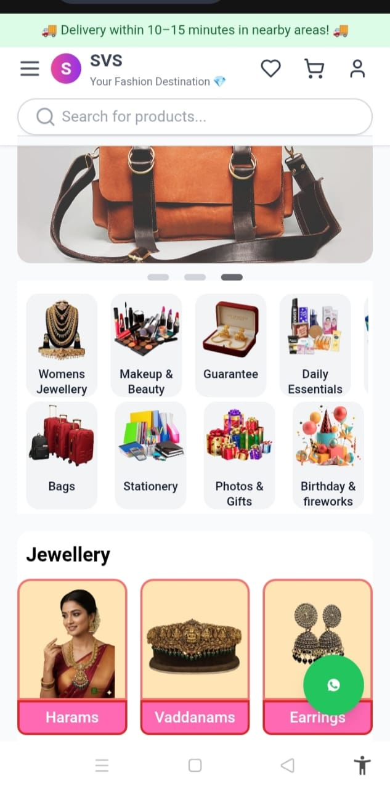

# SVS-Commerce

**SVS-Commerce** is a **mobile-first, full-stack e-commerce platform** built to showcase fashion, beauty, and lifestyle products.  
This project demonstrates a modern shopping experience with a focus on **smooth UI, responsive design, and future MERN stack implementation**.

---

## 📹 Project Showcase

### Screenshots

### Demo Video
[Watch Demo Video](DemoVideo.mp4)

---

## 🚀 Features

- **Mobile-First Design:** Optimized for smartphones and tablets  
- **Product Catalog & Categories:** Browse collections easily  
- **Smooth UI & Animations:** Modern and interactive user experience  
- **Wishlist & Cart:** Save favorites and manage orders (planned)  
- **Admin Dashboard:** For managing products and orders (future)  
- **Secure Authentication:** Login/Register flow (planned)  

---

## 🛠️ Tech Stack & Tools

- **Frontend:** React (Vite) + TailwindCSS  
- **Backend:** Node.js + Express.js (planned MERN stack)  
- **Database:** MongoDB (planned)  
- **Version Control & Hosting:** GitHub, Vercel / Heroku  
- **Design & Prototyping:** Figma, Canva  
- **Authentication:** JWT (planned for future implementation)  

---

## 🌟 Roadmap / Future Plans

1. Full MERN stack integration (MongoDB, Express, React, Node.js)  
2. Admin dashboard for products, categories, and order management  
3. Implement Wishlist, Cart, and Checkout functionality  
4. Add search, filter, and sort features  
5. Smooth animations and UI enhancements  
6. Real-time notifications & analytics dashboard  

---

## 💡 Notes

- This repository currently contains **screenshots, demo videos, and project documentation**.  
- The codebase will be integrated as the full MERN stack in future updates.  
- Designed with scalability and maintainability in mind for future developers or collaborators.

---

**SVS-Commerce** is a showcase of a modern, mobile-first e-commerce experience — built to demonstrate clean design, smooth UI, and scalable full-stack architecture.
